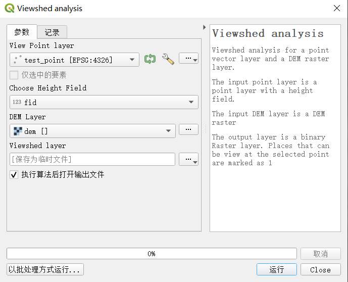

# QGIS视域分析工具

[TOC]

## Development

### 安装插件

1. 下载代码, 链接到 QGIS 插件目录

```bash
git clone https://github.com/GIS-design-application/Viewshed-Plugin-QGIS.git
ln -s ABSOLUTE_PATH_OF_THIS_REPO PATH_OF_QGIS_PLUGIN_DIR
```

> MacOS 插件目录: /Users/**USERNAME**/Library/Application Support/QGIS/QGIS3/profiles/default/python/plugins/**PLUGINNAME**
> 
> Windows 插件目录: C:\\Users\\**USERNAME**\\AppData\\Roaming\\QGIS\\QGIS3\\profiles\\default\\python\\plugins\\**PLUGINNAME**

2. 重启 QGIS，进入 Menu Plugins -> Manage and Install Plugins 

3. 把 viewshed analysis 打钩

### 使用 VS Code 进行开发

#### 1. 配置 Python 环境

1. 根据操作系统 (MacOS, Windows), 复制出 `.vscode/settings.json` 和 `.vscode/launch.json` 两个文件
2. 修改 `.vscode/settings.json` 文件指向的 Python 路径到 QGIS 插件路径
3. 修改 `.vscode/launch.json` 文件指向的 QGIS 插件路径 (指向链接到的文件夹)

#### 2. 相对路径引用问题

针对带有 dialog 的插件, 需要注意包引用格式.

```python
# This works for integragted terminal
# Initialize Qt resources from file resources.py
from resources import *
# Import the code for the dialog
from visibility_analysis_dialog import VisibilityAnalysisDialog
# --------------------------------------
# This works for qgis 
# Initialize Qt resources from file resources.py
from .resources import *
# Import the code for the dialog
from .visibility_analysis_dialog import VisibilityAnalysisDialog
```

#### 3. 调试

使用 QGIS 的 debugvs 插件，这个插件会在本地的 5678 端口创建一个 debug 的传输通道，让 VS Code 的 debug launch 可以进行远程的 attach debugging。

1. 为 QGIS Python 安装 ptvsd

```bash
cd QGIS_PYTHON_PATH
./pip install ptvsd
```

2. 在 QGIS 中安装 Debugvs

3. QGIS 中 `Plugins -> Enable Debug for Visual Studio -> Enable Debug for Visual Studio` 即可打开 Debug Port (localhost:5678)

注意每次修改后都要用 `Plugin Reloader` reload 一次

### Processing Plugins



在`viewshed_analysis_algorithm.py` 中的 `processAlgorithm` 函数导入算法

按照 [algorithm_sample.py](./algorithm_sample.py) 中的接口配置算法

```python
def viewshed_demo(px:float, py:float, pz:float,
					dem_array:np.ndarray, dem_config:dict, max_distance=10000):
	"""一个viewshed算法的demo,主要是用来规范接口和引用方式

	Args:
		px (float): 视点的x坐标
		py (float): 视点的y坐标
		pz (float): 视点的z坐标（高程）
		dem_array (np.ndarray): DEM数据
		dem_config (dict): DEM的配置信息,包括geotransform和projection
			geotransform (tuple): gdal geotransform
			projection (str): gdal projection in wkt
		max_distance (int, optional): 最大可视距离 Defaults to 10000. 
		#? max_distance 有用吗? 这个参数是Copilot推荐的我就加上了

	Returns:
		np.ndarray: 返回一个与dem_array同样大小的数组,可视区域为1,不可视区域为0
	"""

	return -dem_array
```

在引用自己写的文件的时候使用相对路径的方式来引用

```python
from .utils import get_band_data, get_raster_config, save_raster
from .algorithm_sample import viewshed_demo
```

